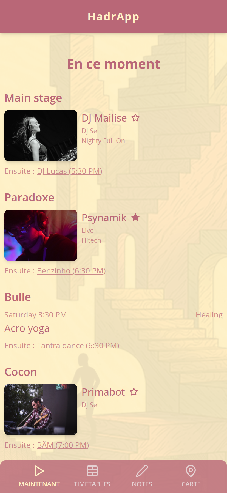
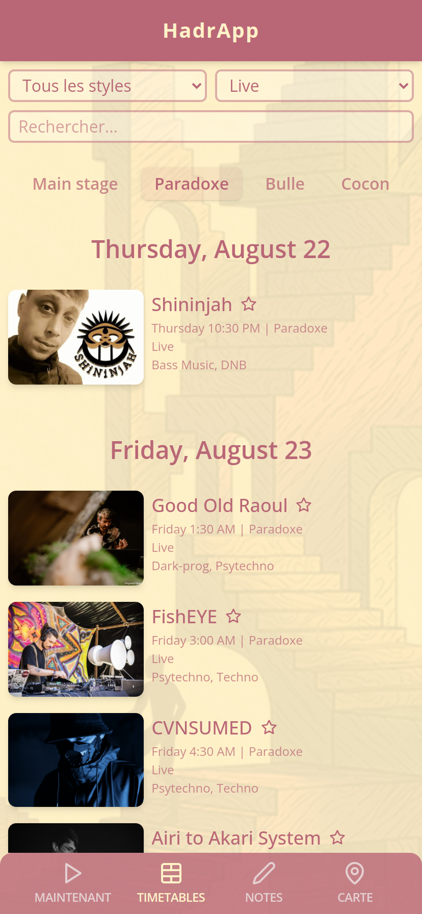

FestivApp is a generic application that provides useful tools to music festival-goers:

- Access the timetables
- Access the festival's map
- View who's playing now and who's next
- Bookmark artists
- Take personal notes about an artist

|          Now playing          |                 Timetables                  |
| :---------------------------: | :-----------------------------------------: |
|  |  |

To create an instance of this app for a festival, you need to copy the example folder and change the values
of the data.json file. If you need assistance to do this, I'd be happy to get you started, feel free to
[contact me](mailto:nilscox.dev@gmail.com)!
